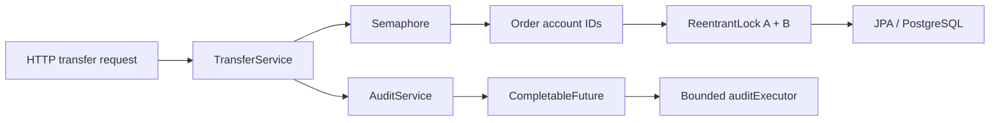

# BankCore

<p align="center">
  
  
  
  
  
</p>

**Concurrency-focused banking backend built to explore safe money transfers under parallel load.**

BankCore is a learning project where the interesting part is not CRUD — it is the transfer path: coordinating concurrent requests, avoiding lock inversion, applying back-pressure, and keeping audit work off the request thread. The project also includes a small React dashboard for accounts, transfers, and admin status.

## Concurrency map

| Concept | Where it is used |
| --- | --- |
| `ReentrantLock` | Per-account locking during transfers |
| `ConcurrentHashMap` | Thread-safe lock registry |
| `Semaphore` | Caps concurrent transfer attempts at 100 |
| `AtomicLong` | Thread-safe transaction ID generation |
| `volatile` | Runtime transfer feature flag |
| `CompletableFuture` | Asynchronous audit writes |
| `ThreadPoolExecutor` | Bounded audit queue + `CallerRunsPolicy` back-pressure |
| Virtual Threads | Enabled through Spring configuration |

The project also uses modern Java features such as **records, sealed interfaces, switch expressions, pattern matching, and `var`**. The same concurrency ideas are documented in the project notes you shared: deadlock-aware lock ordering, async audit, bounded executors, atomic IDs, and runtime flags. fileciteturn36file0

## Transfer flow



## Stack

**Backend:** Java 25 · Spring Boot · Spring Data JPA · PostgreSQL · Flyway · OpenAPI  
**Frontend:** React · Vite · Tailwind CSS  
**Runtime:** Docker Compose · Virtual Threads

## Run locally

```bash
docker compose up -d
./mvnw spring-boot:run
```

In another terminal:

```bash
cd frontend
npm install
npm run dev
```

- API: `http://localhost:8080`
- PostgreSQL: `localhost:5433`
- Swagger UI: `http://localhost:8080/swagger-ui.html`
